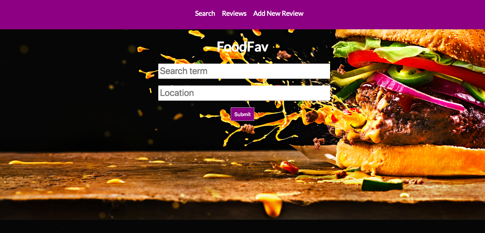

# foodfav
Project 3 for Forest, Said, Shirley, Daquan

## Project Summary

It's a web application where any user can look up on local restaurants' data and its crowd-sourced reviews. Users can register and log in to save restaurants to their favorites and write reviews on restaurants they visited. Restaurants will be filtered by location and type of cuisine. Users can search for restaurants based on their name, location, and cuisine type. Restaurants will have information on location, rating, and type of cuisine. 

## Wireframes

## User Stories

## ERDs

## List of 3rd Party Technologies

[Yelp Fusion](https://www.yelp.com/fusion)

## MVP
- Create database foodfav_db with tables user, favorites, and reviews.
- Create models and controllers for user, favorites, and reviews to make it CRUD
- Implement the yelp API on server side. 
- Create necessary components on React - search box, search results list, review list, review form to add/edit reviews, favorites list, restaurant component with information on the restaurant. 
- Implement user auth in React
- Style the application with CSS

## Post MVP
- implement a Google Maps api to pin locations of restaurants

## Project Timeline
- Create schema and seed - 2 hours
- Create models and controllers - 5 hours
- API implementation - 3 hours
- Create React components - 20 hours
- User auth - 5 hours
- Styling - 3 hours
